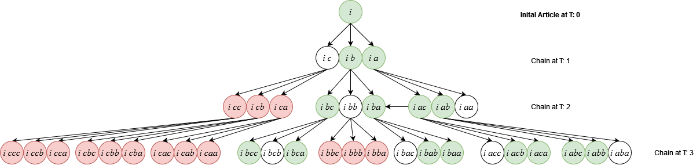
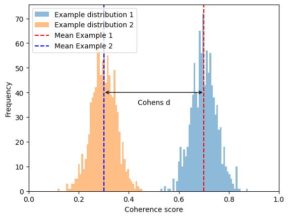
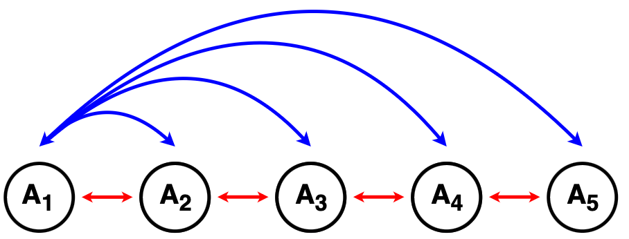

# **avis — Analyzing Evolving Stories in News Articles (Refactored)**

> **Research-driven NLP + Optimization for Story Evolution**

---
## 🔹 Abstract (from the paper)
> There is an overwhelming number of news articles published every day. Tracking how a news story *evolves over time* is difficult because similarity-based methods tend to circle around the same event instead of revealing its historical origins. This project implements and extends a framework that **mines historical news to detect the origin of events, segments timelines into coherent phases, and identifies the most relevant documents at each turning point**. The approach combines NLP preprocessing, topic modeling, and a continuous optimization formulation that balances **coherence, diffusion, temporal structure, and document relevance**. Quantitative metrics and human evaluations show that the method discovers statistically significant and meaningful storylines in reasonable time, with potential for predicting future entities in evolving stories. 

*(Summarized from Barranco et al., 2017)*

---
## 🎯 What this project is about (for recruiters)

This repository is a **clean, production-style refactor** of a research prototype for:

- **News story evolution analysis**
- **Entity-centric NLP and topic modeling (LDA, TF–IDF)**
- **Graph/optimization-based storytelling (“connecting the dots”)**
- **Continuous-time segmentation of document streams**
- **Relevance-weighted document selection**
- **Statistical validation and human-in-the-loop evaluation**
- **Downstream prediction of future entities from past story evolution**

**Keywords:** NLP, text mining, topic modeling, constrained optimization, temporal modeling, document networks, L-BFGS-B, diffusion processes, information retrieval, explainable AI, data science.

---
## 🧠 Conceptual Methodology (high-level)

### 1️⃣ Preprocessing (Framework)
- Named-entity extraction (persons, organizations, locations)
- TF–IDF representation over entities
- LDA topic modeling to obtain document-topic distributions
- Temporal + topical filtering of candidate documents

### 2️⃣ Story Generation (Core Contribution)
The system identifies **turning points in time** and assigns documents to smooth temporal segments using a continuous membership function. The objective jointly balances:

- **Incoherence (within segments)** — documents in the same phase should be similar
- **Unconnectedness (across segments)** — different phases should represent different events
- **Temporal penalty** — discourages grouping far-apart documents
- **Overlap penalty** — prevents turning points from collapsing together
- **Relevance weights** — highlights the most important documents per segment
- **Uniformity penalty** — avoids trivial solutions

Optimization is performed with **L-BFGS-B**.

---
## 📊 Figures from the paper (added visuals)

### 🔹 Diffusion vs Similarity — long vs short histories


This figure illustrates the core intuition of the project: diffusion-based storytelling can trace **longer, more semantically coherent historical chains**, while pure similarity tends to stay local and repetitive.

---
### 🔹 Beam Search Procedure


This diagram shows how candidate story paths are expanded and pruned during **beam search**, balancing exploration of alternatives with computational tractability.

---
### 🔹 Statistical Effect Size (Cohen’s d)


Effect size analysis demonstrates that improvements over baselines are not only statistically significant but also **practically meaningful**.

---
### 🔹 Ablation / Sensitivity Plot


This plot summarizes how sensitive the solution is to key hyperparameters (e.g., distance threshold, overlap penalty, topic divergence). Stable performance across settings indicates a robust method.

---
## 🏗 Repository structure (clean, maintainable)
```
avis-refactored/
├── src/avis/
│   ├── nlp/           # tokenization, stopwords, preprocessing
│   ├── models/        # TF–IDF, KMeans topic tools
│   ├── experiments/   # beam search & parameter sweep scaffolding
│   └── data/          # Danish stopwords
├── original/          # your original notebooks (untouched)
├── pyproject.toml
└── README.md
```

---
## 🚀 Installation
```bash
pip install -e .
```

## 🧪 Minimal example (TF–IDF + KMeans topics)
```python
from avis.nlp.stopwords import load_danish_stopwords
from avis.models.vectorize_tfidf import fit_tfidf, TfidfConfig
from avis.models.kmeans_topics import fit_kmeans_topics, top_terms_per_cluster, KMeansTopicConfig

stop = load_danish_stopwords()
docs = [
    "Dette er en artikel om politik og økonomi...",
    "Sport og fodbold nyheder...",
]

vectorizer, X = fit_tfidf(docs, stop, TfidfConfig(max_features=5000))
model = fit_kmeans_topics(X, KMeansTopicConfig(n_clusters=2))
print(top_terms_per_cluster(model, vectorizer, top_n=8))
```

---
## 🏁 Conclusion (from the paper)
> The framework successfully uncovers the historical evolution of news stories from large archives. It not only reconstructs meaningful timelines but also enables **future entity prediction** from past diffusion patterns. The authors propose extending the work toward early-warning systems for emerging events and incorporating **interactive user feedback** to adapt the optimization to human expectations.

---
## 📚 Reference
Barranco, R. C., Boedihardjo, A. P., & Hossain, M. S. (2017). *Analyzing Evolving Stories in News Articles*. ACM Conference.

