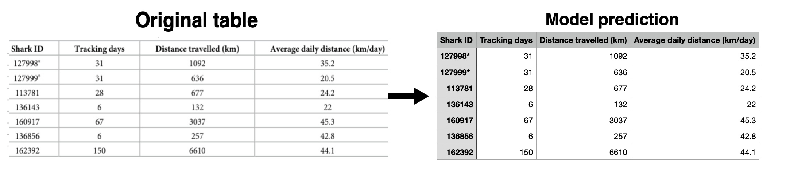
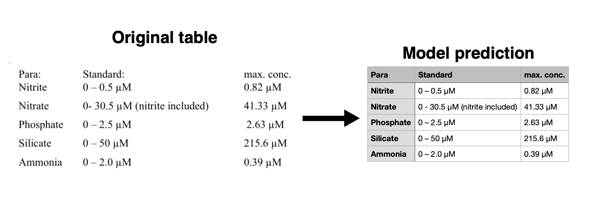
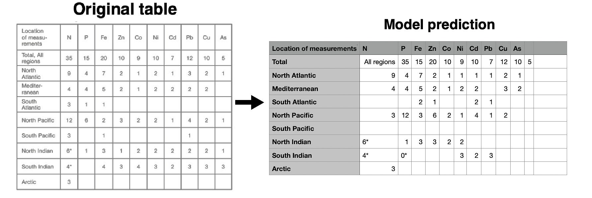
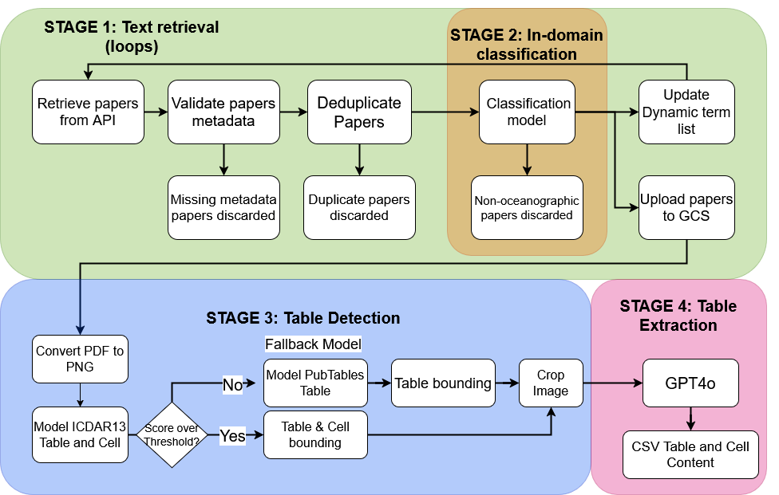

# **TIDE‑4 — Automated Table Extraction from Scientific PDFs**

> **From oceanography papers to structured data — fully automated.**

---
## What We built (portfolio summary)
TIDE‑4 is an **end‑to‑end ML pipeline** that automatically finds oceanography papers, identifies relevant ones, detects tables in PDFs, and converts them into clean CSV files. The system reduces manual data curation for researchers while maintaining high extraction quality.

**Impact:** Faster data reuse, fewer manual errors, and a reproducible data pipeline for scientific literature.

---
## How it works (4 stages)

### **1) Text Retrieval**

Adaptive querying of the CORE API with a self‑improving list of oceanographic terms, automatic deduplication, and metadata validation.

### **2) In‑Domain Classification**

A high‑precision **SVM + TF–IDF** classifier filters for truly oceanographic papers (ROC‑AUC ≈ 0.96), keeping downstream noise low.

### **3) Table Detection**

Two‑model Detectron2 setup (Faster R‑CNN):
- Joint table + cell detector (ICDAR2013) with a custom containment loss.
- Strong table‑only fallback model (PubTables‑1M, AP ≈ 98%).

### **4) Table Extraction (LLM)**

Cropped table images are sent to **GPT‑4o**, which returns structured CSV. Low cost, high accuracy for well‑structured tables.

---
## 📊 Results (highlights)
- ~20% of retrieved papers are truly oceanographic → validates need for Stage 2.
- Very high table localization accuracy (PubTables‑1M AP ≈ 98%).
- ~75% of manually checked tables produced fully valid CSV.
- ~$0.003 per table extraction with GPT‑4o.

---
## 🛠 Tech Stack
**Data & NLP:** Python, Pandas, scikit‑learn (SVM, TF–IDF, χ² feature selection)

**Computer Vision:** Detectron2, Faster R‑CNN, custom loss functions

**LLMs:** GPT‑4o (multimodal table interpretation)

**Data Engineering:** CORE API, PDF→image rendering, deduplication, pipeline orchestration

**MLOps / Reproducibility:** Modular package structure, experiment scripts, clear stage separation

---
## 🏗 Repository (clean refactor)
```
tide4/
├── src/tide4/
│   ├── retrieval/      # CORE API + dynamic term search
│   ├── classification/ # SVM + TF–IDF pipeline
│   ├── detection/      # Detectron2 models
│   └── extraction/     # GPT‑4o interface
└── original/           # Original notebooks (unchanged)
```

---
## 🏁 Conclusion
TIDE‑4 shows that **automated, domain‑specific table extraction from scientific PDFs is practical and cost‑effective**, combining classical ML, deep vision models, and multimodal LLMs into one coherent system.
